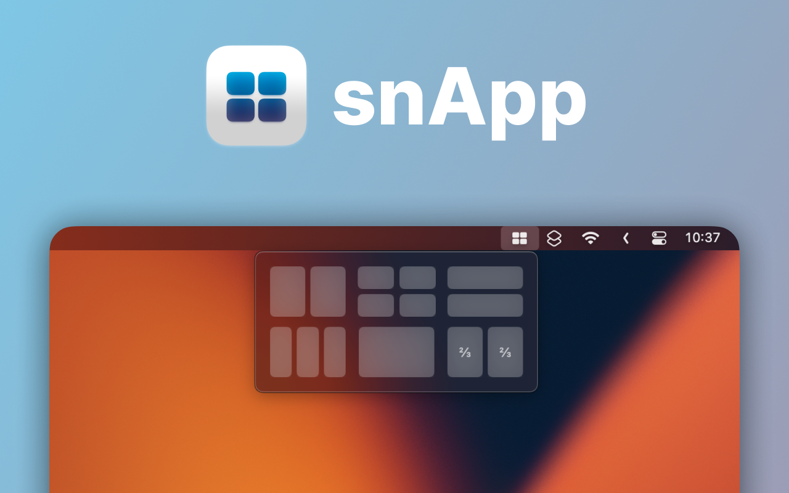

# snApp

<a href="https://apps.apple.com/app/snapp-powerful-window-manager/id6449620109" target="_blank">
  
</a>

snApp is a powerful window management utility for macOS, designed to enhance multitasking by providing features similar to Windows' Snap Layouts and iPad's multitasking capabilities. Powered by [a Siri Shortcut at heart](http://itecheverything.com/snap), snApp lives in your macOS menu bar and offers a seamless and intuitive way to manage your windows.

## Features

- **Menu Bar Integration**: Easily accessible from the macOS menu bar.
- **Two Interface Styles**: Choose between two beautiful interface styles for managing windows; Windows-style or iPad-style.
- **Privacy Focused**: No user data is collected.

## Installation

To build the project locally:

1. **Clone the repository:**
    ```bash
    git clone https://github.com/iTechEverything/snapp.git
    ```
2. **Navigate to the project directory:**
    ```bash
    cd snapp
    ```
3. **Open the project in Xcode:**
    ```bash
    open snApp.xcodeproj
    ```
4. **Install dependencies:**
    Ensure all dependencies are resolved using Xcode’s package manager.

5. **Build and run the project:**
    - Select the snApp target.
    - Choose your current Mac.
    - Click the Run button or press `Cmd + R`.

Download snApp from the [Mac App Store]([https://apps.apple.com/us/app/snapp-powerful-window-manager/id1668579304](https://apps.apple.com/app/snapp-powerful-window-manager/id6449620109)).

## Contributing

We welcome contributions from the community! To contribute:

1. Fork the repository.
2. Create a new branch for your feature or bug fix:
    ```bash
    git checkout -b feature-name
    ```
3. Make your changes and commit them:
    ```bash
    git commit -m "Description of your feature or fix"
    ```
4. Push to your branch:
    ```bash
    git push origin feature-name
    ```
5. Create a Pull Request on GitHub.

   
## Open Source Packages Used

snApp utilizes several open-source packages:

- **[Fluid Menu Bar Extra](https://github.com/lfroms/fluid-menu-bar-extra)**: A lightweight tool for building great menu bar extras with SwiftUI. | Used to implement the menu bar extra with SwiftUI, while preserving the fade animation of an AppKit MenuBarExtra.
- **[SVEVideoUI](https://github.com/SergioEstevao/SVEVideoUI)**: A Swift package to simplify the integration of video playback UI in iOS and macOS apps. | Used for Onboarding

## Special Thanks To
- **[ScriptingShortcuts](https://github.com/mralexhay/ScriptingShortcuts)**: This sample project, from the late Alex Hay, is what powers snApp at its core, allowing it to communicate with the Siri Shortcuts app in real time.


## Acknowledgments

Linkeeper is developed and maintained by [Starlight Apps LLP](https://starlightapps.org).


## Contact

For any inquiries or feedback, please open an issue on GitHub or contact us at contact@starlightapps.org.

## License

This project is licensed under the MIT License - see the [LICENSE](LICENSE) file for details.

---

**Happy window managing!**
